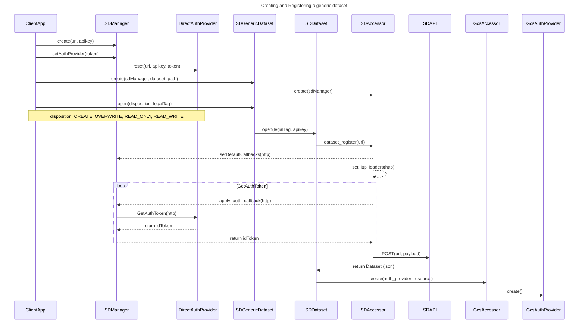

# SDAPI C++

SDAPI is a C++ client api library designed to interact with seismic store.

Seismic Store is a Schlumberger cloud-based solution designed to store and manage datasets of any size in the cloud by enabling a secure way to access them through a scoped authorization mechanism. Seismic Store overcomes the object size limitations imposed by a cloud provider, by managing generic datasets as multi independent objects and, therefore, provides a generic, reliable and a better performed solution to handle data on a cloud storage.

The sdapi library will allow you to easily interact with seismic store and perform operations like upload, download and manage datasets of any size with seismic store.

## Prerequisites

- [vcpkg](https://github.com/microsoft/vcpkg)
- [Visual Studio 2019](https://visualstudio.microsoft.com/vs/downloads/)

## Configure vcpkg

Follow these steps to configure `vcpkg` and to install `CURL` packages.

### Extract vcpkg

`Linux`

```bash
~/$ ./bootstrap-vcpkg.sh
```

`Windows`

```powershell
`PS> .\bootstrap-vcpkg.bat`
```

### Hook up user-wide integration

>Note: requires admin on first use

`Linux`

```bash
~/$ ./vcpkg integrate install
```

`Windows`

```powershell
PS> .\vcpkg integrate install
```

### Install CURL package

`Linux`

```bash
~/$ ./vcpkg install curl
```

`Windows`

```powershell
PS> .\vcpkg install curl:x64-windows
```

### Optional: Auto-completion

vcpkg supports auto-completion of commands, package names, options etc in Powershell and bash. To enable tab-completion, use one of the following:

`Linux`

```bash
~/$ ./vcpkg integrate bash
```

`Windows`

```powershell
PS> .\vcpkg integrate powershell
```

and restart your console.

## SDAPI Build Instructions

Follow these instructions to build the sdapi C++ library (cmake project).

### Linux

```bash
1. mkdir build && cd build
2. cmake -DCMAKE_TOOLCHAIN_FILE=[vcpkg directory]/scripts/buildsystems/vcpkg.cmake ../src
3. make -j $(nproc)
```

### Windows

Navigate to the root folder of your project, and then execute the following command:

```PowerShell
.\scripts\build-win64-vs16.ps1 [Debug|Release] [Path to vcpkg directory]
```

Builds option modes that can be specified in the cmake configuration step (2):

- BUILD_FTEST, build functional/example tests
- BUILD_UTEST, build integral unit tests
- BUILD_BENCHMARKS, build sdapi/storage benchmarks
- BUILD_E2ETEST, build regression e2e tests

## UML SEQUENCE DIAGRAMS

### GCP Dataset Registration



## LIBRARY USAGE EXAMPLES

### Example 01: *The SDManager*

The SDManager is the main configuration object for seismic store. It stores and manages service url, key and user credentials. It must be initialized as first in a client code.

```cpp
#include "SDManager.h"

// default constructor will initialize the service URL
// and the service api key reading the SD_SVC_URL and
// SD_SVC_API_KEY environment variables.
seismicdrive::SDManager manager;

// It is required to set at least one Auth provider
manager.setAuthProviderFromImpToken("The seistore Impersonation JWT");
manager.setAuthProviderFromString( "The user idtoken");
```

### Example 02: *Multiobject Upload with SDGenericDataset*

```cpp
#include "SDGenericDataset.h"

#include <fstream>
#include <cmath>

// localFile: local file path
// seistoreFile: seistore file path sd://tenant/subproject/dataset
// chunkSize: size of a block (MB)
void upload(
    const std::string& localFile, 
    const std::string& seistoreFile,
    uint64_t chunkSize) {

    // MB in bytes
    chunkSize = chunkSize * 1048576;

    // open the local file and retrieve the size
    std::fstream file(localFile, std::ios::in | std::ios::binary | std::ios::ate);
    std::streamsize size = file.tellg();
    file.seekg(0, std::ios::beg);

    // number of transfers to perform
    auto ntrx = static_cast<int>(std::floor(size / chunkSize));

    // size of the last transfer
    auto rtrxSize = size - ntrx * chunkSize;

    // initialize the configuration manager
    seismicdrive::SDManager sdmanager;
    sdmanager.setAuthProviderFromString( "The user idtoken");

    // initialize the seismic store dataset
    seismicdrive::SDGenericDataset sdgd(&sdmanager, seistoreFile);

    // open the seismic store dataset as create (::OVERRIDE if already exist)
    sdgd.open(seismicdrive::SDDatasetDisposition::CREATE);

    // write blocks
    std::vector<char> buffer(chunkSize);
    for(auto ii=0; ii<ntrx; ii++) {
        file.read(buffer.data(), chunkSize);
        sdgd.writeBlock(ii, buffer.data(), chunkSize);
    }

    // write last block
    if(rtrxSize) {
        file.read(buffer.data(), rtrxSize);
        sdgd.writeBlock(ntrx, buffer.data(), rtrxSize);
    }

    // close the seistore dataset
    sdgd.close();

}
```

### Example 03: *Multiobject Download with SDGenericDataset*

```cpp
#include "SDGenericDataset.h"

#include <fstream>
#include <cmath>

// localFile: local file path
// seistoreFile: seistore file path sd://tenant/subproject/dataset
void downloader(
    const std::string& localFile, 
    const std::string& seistoreFile) {

    // initialize the configuration manager
    seismicdrive::SDManager sdmanager;
    sdmanager.setAuthProviderFromString( "The user idtoken");

    // initialize the seismic store dataset
    seismicdrive::SDGenericDataset sdgd(&sdmanager, seistoreFile);

    // open the seismic store dataset for READ ONLY
    sdgd.open(seismicdrive::SDDatasetDisposition::READ_ONLY);    

    // get the number of object
    auto nobject = sdgd.getBlockNum();

    // open the local file for write
    std::fstream file(localFile, std::ios::out | std::ios::binary);

    // read all blocks
    for(auto ii=0; ii<nobject; ii++) {

         // you can skip this if you already know the size (faster)
        auto size = sdgd.getBlockSize(ii);
        std::string res(size, 'x');

        // read the block from seistore to local file
        sdgd.readBlock(ii, const_cast<char*>(res.c_str()), 0, size);
        std::fstream ofile(std::to_string(ii), std::ios::out | std::ios::binary);
        file.write(res.c_str(), size);
    }

    // close local file
    file.close();

    // close seistore dataset
    sdgd.close();

}
```

### More examples in ```src/test/seismic-store```